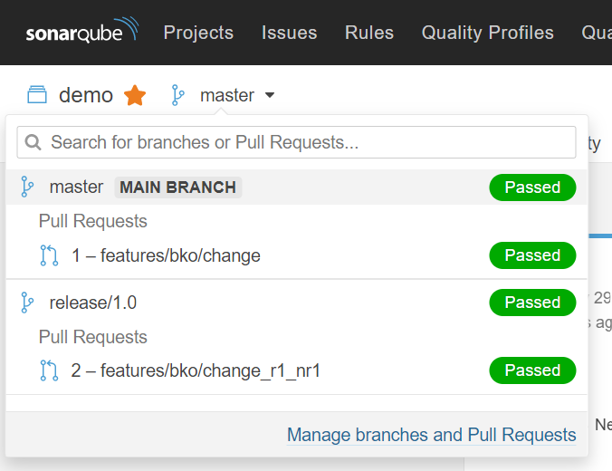

# Demo: Sonarqube Community Branch Plugin

Demo scenario using [Sonarqube Community Branch Plugin](https://github.com/mc1arke/sonarqube-community-branch-plugin) in combination with Jenkins and GitLab.

The Jenkins instance is setup with 3 Pipeline jobs:

* [tests-master](http://localhost:8080/job/tests-master/): Running *build, test, analyze* on `master` branch
* [tests-release-1.0](http://localhost:8080/job/tests-release-1.0/): Running *build, test, analyze* on `release-1.0` branch
* [merge-request](http://localhost:8080/job/merge-request/): Triggered by Merge Requests in GitLab

## System Requirements

* Docker Compose in Linux environment (e.g. Docker for Windows with WSL2 Ubuntu)
* Hardware resources
  * Memory: >8 GB
  * Disk Space: ~20 GB

## Setup Infrastructure: Jenkins, GitLab & SonarQube

URLs:

* Jenkins - <http://localhost:8080>
* GitLab - <http://localhost:8000>
* SonarQube - <http://localhost:9000>

### Docker Installation

```bash
export JENKINS_HOME=/srv/jenkins
export GITLAB_HOME=/srv/gitlab
export SONAR_HOME=/srv/sonar
export POSTGRESQL_HOME=/srv/postgresql

sudo mkdir /srv
sudo chown -R <OWNER>:<GROUP> /srv
mkdir -p $JENKINS_HOME
mkdir -p $GITLAB_HOME
mkdir -p $SONAR_HOME
wget -O $SONAR_HOME/sonarqube-community-branch-plugin-1.6.0.jar https://github.com/mc1arke/sonarqube-community-branch-plugin/releases/download/1.6.0/sonarqube-community-branch-plugin-1.6.0.jar
mkdir -p $POSTGRESQL_HOME

sysctl -w vm.max_map_count=262144

docker-compose up -d --build
```

Uninstall/Cleanup Docker Installation:

```bash
docker-compose down

sudo rm -rf /srv/*
```

### Application Configurations

#### GitLab

1. Set initial password (for user `root`): `gitlabpw`
1. Deactivate [Auto DevOps pipeline for all projects](http://localhost:8000/admin/application_settings/ci_cd#js-ci-cd-settings)
1. Create [new project](http://localhost:8000/projects/new#create_from_template) in GitLab based on [Spring Template](https://gitlab.com/gitlab-org/project-templates/spring):

     ```markdown
     Project name = demo
     ```

1. Create [new branch](http://localhost:8000/root/demo/-/branches/new)

     ```markdown
     Branch name = release/1.0
     ```

1. Create [GitLab API Token](http://localhost:8000/-/profile/personal_access_tokens) for Jenkins

     ```markdown
     Name   = Jenkins
     Scopes = api, read_api
     ```

1. Create [GitLab API Token](http://localhost:8000/-/profile/personal_access_tokens) for SonarQube

     ```markdown
     Name   = SonarQube
     Scopes = api, read_api
     ```

1. Prepare GitLab Merge Request for Project `root/demo`
   * Deactivate [Auto DevOps](http://localhost:8000/root/demo/-/settings/ci_cd#autodevops-settings)
   * Activate [Allow requests to the local network from web hooks and services](http://localhost:8000/admin/application_settings/network#js-outbound-settings)
   * Add [Webhook](http://localhost:8000/root/demo/hooks)

     ```markdown
     URL          = http://jenkins:8080/project/merge-request
     Secret Token = 286342d2ee8dfbe063917e2b91b34d60
     Trigger      = Push Events, Note Events, Merge Requests Events, SSL Verification: disabled
     ```

#### SonarQube

1. Login: `admin / admin`
1. Create [Token](http://localhost:9000/admin/users) for Jenkins
1. Create [Webhook](http://localhost:9000/admin/webhooks)

     ```markdown
     Name = Jenkins
     URL  = http://jenkins:8080/sonarqube-webhook/
     ```

1. Configure SonarQube ALM Integration GitLab
   * Create GitLab [Configuration](http://localhost:9000/admin/settings?category=almintegration)

     ```markdown
     API URL = http://gitlab:8000/api/v4
     Token   = < GitLab API Token for SonarQube >
     ```

#### Jenkins

1. Login: `jenkins / jenkinspw`
1. Update API token for [GitLab Credential](http://localhost:8080/credentials/store/system/domain/_/credential/gitlab_token/update)
1. Update Secret for [SonarQube Credential](http://localhost:8080/credentials/store/system/domain/_/credential/sonarqube_token/update)
1. Run Jenkins job `tests-master`
1. Run Jenkins job `tests-release-1.0`

## GitLab Merge Request

1. Enable [Pull Request Decoration](http://localhost:9000/project/settings?category=pull_request_decoration_binding&id=com.example%3Ademo) in SonarQube

     ```markdown
     Configuration name = < select gitlab >
     Project ID         = root/demo
     ```

1. Start a new merge request by changing [README.md](http://localhost:8000/-/ide/project/root/demo/tree/master/-/README.md/) file

### Result: GitLab Merge Request Decoration


### Result: SonarQube Branch View



## Issues with Sonarqube Community Branch Plugin

* *Sonarqube Community Branch Plugin* removes all comments in Merge Request after each *Pull Request Analysis* and recreates the decoration comments: see [Issue #141](https://github.com/mc1arke/sonarqube-community-branch-plugin/issues/141)  
Workaround: n/a
* Summary comment is created as *thread* and not as *comment*: see [Issue #106](https://github.com/mc1arke/sonarqube-community-branch-plugin/issues/106)  
Workaround: Manually resolve thread before merge
* *Sonarqube Community Branch Plugin* does not support current version of SonarQube 8.6: see [Issue #295](https://github.com/mc1arke/sonarqube-community-branch-plugin/issues/295)  
Workaround: use version `8.5.1`  
See also [discussion](https://community.sonarsource.com/t/error-unknown-url-api-alm-settings-validate-when-adding-alm-integration/35866/5) on Sonarsource Community
